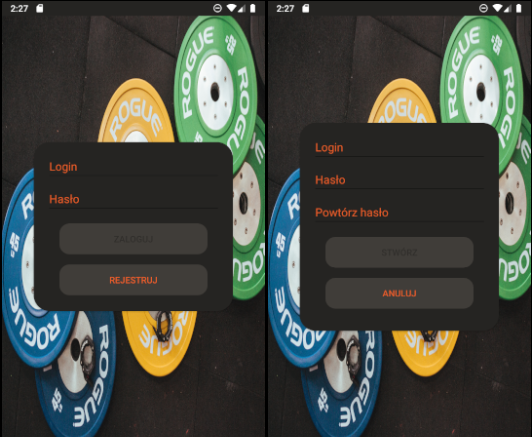
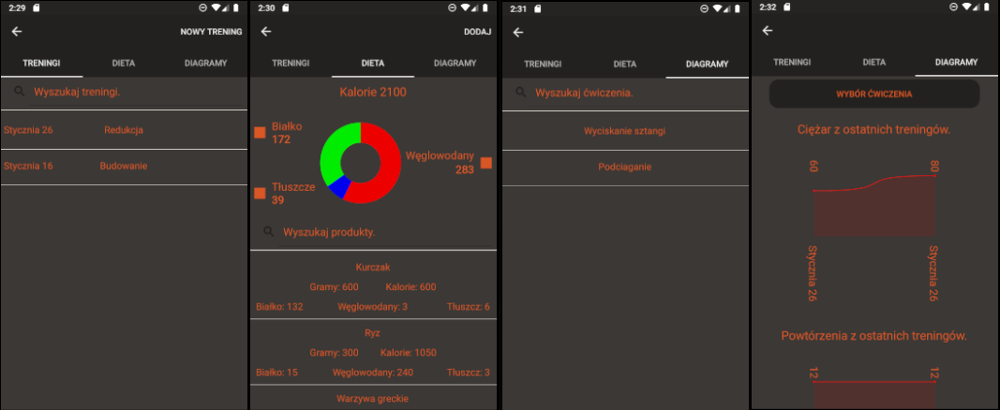
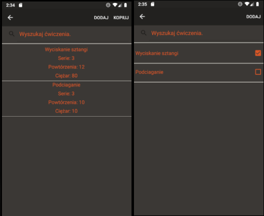
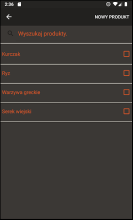
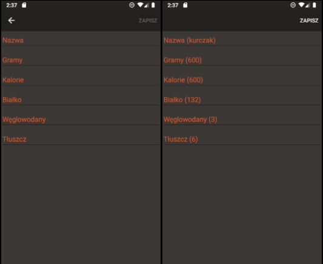

# GymHelper

## Table of contents

- [General info](#general-info)
- [Screenshots](#screenshots)
- [Technologies](#technologies)
- [Setup](#setup)

## General info

GymHelper helps track progress at the gym.

## Screenshots

Login and register view

Home view (workout list, diet, exercise diagrams)

Workout exercises view and view of all user exercises.

View of all user products.

Example view for adding and editing data.

## Technologies

- Xamarin Forms.
- XAML.
- SQLite.

## Setup

Requirements:

- Xamarin.
- Andorid emulator.

To run the application, press F5 in Visual Studio.
